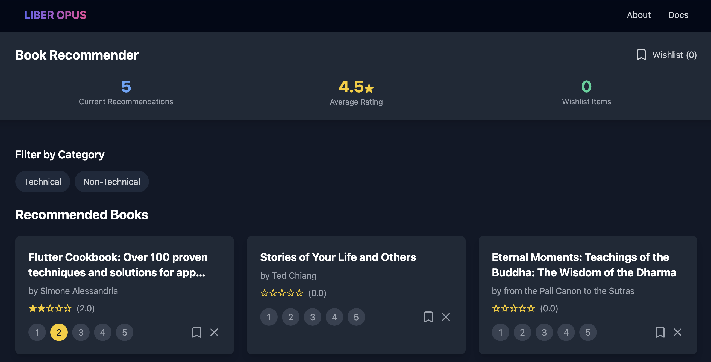

# Liber Opus -Book Recommender

A modern book recommendation system built with FastAPI and React. The application helps users discover new books based on their ratings and preferences, with a focus on technical and non-technical books. I use this by importing my Goodreads CSV and rating books that helps the LLM generate recommendations.

Check it out at https://liberopus.vercel.app/




## Features

- 📚 Book discovery and recommendations powered by Google's Gemini LLM
- ⭐ Rate books and track your reading history
- 📋 Maintain a personal wishlist
- 🏷️ Technical vs non-technical book categorization
- 📊 Average rating system


## Tech Stack

- **Backend**: FastAPI (Python)
- **Database**: SQLite
- **Frontend**: React with TypeScript
- **AI**: Google Gemini Pro LLM


## Getting Started

### Prerequisites

- Python 3.8+
- Node.js 14+
- SQLite
- Google Cloud API Key (for Gemini Pro)


## API Endpoints

### Books
- `GET /books` - Get all books
- `POST /add-book` - Add a new book
- `POST /import-goodreads` - Import books from Goodreads CSV

### Ratings
- `GET /ratings` - Get all ratings
- `POST /ratings` - Rate a book
  ```json
  {
    "book_id": "string",
    "rating": number (1-5)
  }
  ```

### Recommendations
- `POST /get-recommendations` - Get personalized book recommendations
  ```json
  {
    "user_history": ["book_id1", "book_id2"],
    "user_ratings": {
      "book_id": rating
    }
  }
  ```

### Wishlist
- `GET /wishlist` - Get user's wishlist
- `POST /wishlist/add` - Add book to wishlist
- `DELETE /wishlist/remove/{book_id}` - Remove book from wishlist
- `PUT /wishlist/reorder` - Reorder wishlist items

### Book Management
- `POST /dismiss-book` - Dismiss a book (won't show in recommendations)
- `GET /dismissed-books` - Get list of dismissed books

## Database Schema

```sql
books:
  - id (TEXT PRIMARY KEY)
  - title (TEXT)
  - author (TEXT)
  - description (TEXT)
  - average_rating (REAL)
  - topics (TEXT)
  - technical_level (TEXT)
  - publication_year (INTEGER)
  - page_count (INTEGER)

ratings:
  - id (INTEGER PRIMARY KEY)
  - book_id (TEXT)
  - rating (INTEGER)
  - timestamp (DATETIME)

wishlist:
  - id (INTEGER PRIMARY KEY)
  - book_id (TEXT)
  - notes (TEXT)
  - added_at (DATETIME)
  - display_order (INTEGER)

dismissed_books:
  - id (INTEGER PRIMARY KEY)
  - book_id (TEXT)
  - timestamp (DATETIME)
```

## Environment Variables

Create a `.env` file in the root directory:

```env
DATABASE_URL=books.db
GOOGLE_API_KEY=your_google_api_key  # Required for Gemini recommendations
```

The recommendation system uses Google's Gemini Pro LLM (`main.py`) to provide personalized book suggestions based on:
- User's reading history
- Book ratings
- Technical preferences
- Reading patterns

The LLM analyzes the user's preferences and book metadata to generate contextually relevant recommendations, taking into account factors like:
- Technical vs non-technical preferences
- Author similarity
- Topic relationships
- Reading level progression

1. Backend: Deploy as a Web Service
   - Build Command: `pip install -r requirements.txt`
   - Start Command: `uvicorn api:app --host 0.0.0.0 --port $PORT`

2. Frontend: Deploy as a Static Site
   - Build Command: `npm run build`
   - Publish Directory: `dist`

## Contributing

1. Fork the repository
2. Create a feature branch
3. Commit your changes
4. Push to the branch
5. Create a Pull Request

## License

This project is licensed under the MIT License.
